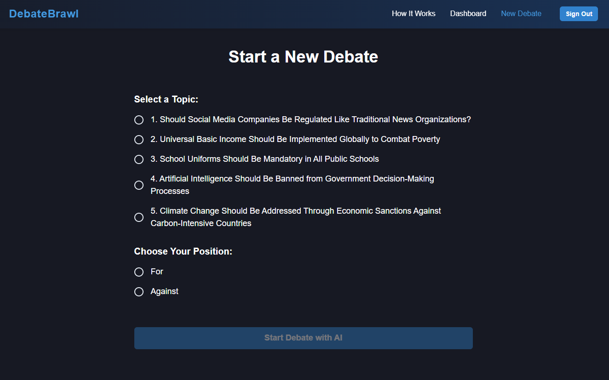
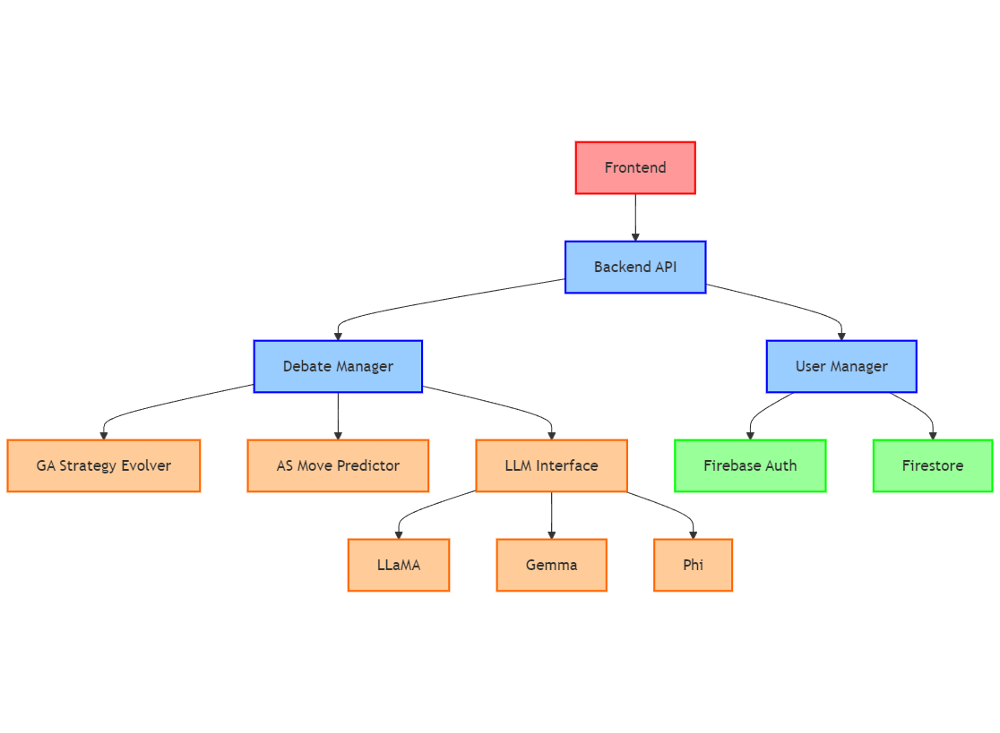
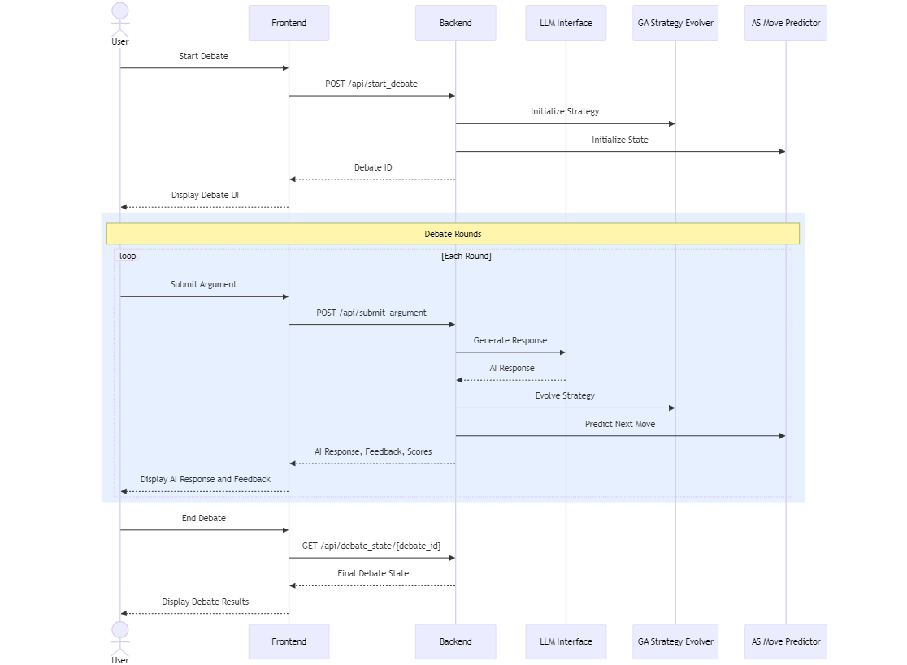
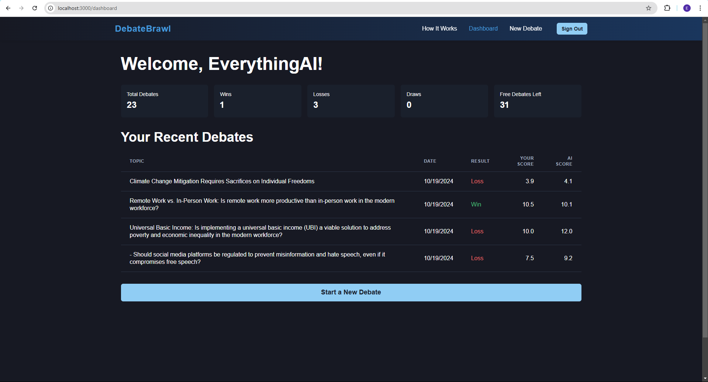
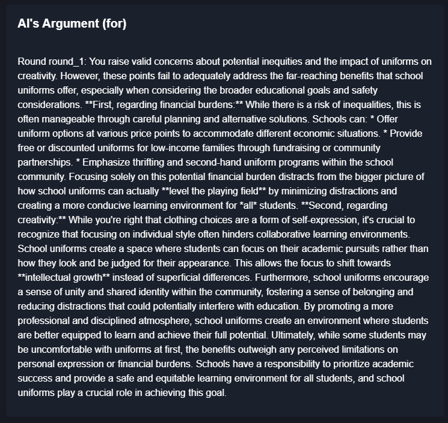
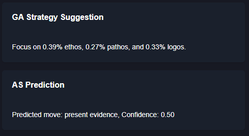

# DebateBrawl 🎯

A sophisticated AI-powered debate platform that integrates Large Language Models with Genetic Algorithms and Adversarial Search to create a dynamic and adaptive debating experience.



## Table of Contents
- [Overview](#overview)
- [Features](#features)
- [Architecture](#architecture)
- [Prerequisites](#prerequisites)
- [Installation](#installation)
- [Configuration](#configuration)
- [Running the Application](#running-the-application)
- [Screenshots](#screenshots)
- [Technical Details](#technical-details)
- [Contributing](#contributing)
- [License](#license)

## Overview

DebateBrawl is an interactive platform where users can engage in intellectually stimulating debates against an advanced AI opponent. The system utilizes:
- Large Language Models (LLaMA, Gemma, Phi) for generating contextually relevant arguments
- Genetic Algorithms for evolving debate strategies
- Adversarial Search for predicting and countering user moves



## Features

- 🤖 AI-powered debate opponent that adapts to your style
- 📊 Real-time argument evaluation and feedback
- 🧬 Evolving debate strategies using Genetic Algorithms
- 🔄 Adversarial Search for strategic counter-arguments
- 📱 Responsive web interface built with Next.js and Chakra UI
- 🔒 Secure authentication with Firebase
- 💾 Firestore database for storing debate history and user data

## Architecture

### Frontend
- Next.js 14
- TypeScript
- Chakra UI
- Firebase Authentication
- Real-time updates

### Backend
- FastAPI
- Ollama for LLM integration
- Custom implementations of GA and AS
- Firebase Admin SDK
- Firestore Database

## Prerequisites

1. Node.js (v18+)
2. Python (3.10+)
3. [Ollama](https://ollama.ai/download)
4. Firebase account
5. Git

## Installation

### 1. Clone the Repository
```bash
git clone git@github.com:prakash-aryan/debatebrawl-app.git
cd debatebrawl-app
```

### 2. Install Ollama Models
```bash
# Install required models
ollama pull llama3.2:3b-instruct-q8_0
ollama pull gemma2:2b-instruct-q8_0
ollama pull phi3.5:3.8b-mini-instruct-q5_K_M
```

### 3. Backend Setup
```bash
cd debatebrawl_backend

# Create and activate virtual environment
python -m venv .venv
source .venv/bin/activate  # On Windows: .venv\Scripts\activate

# Install dependencies
pip install -r requirements.txt
```

### 4. Frontend Setup
```bash
cd ../debatebrawl_frontend
npm install
```

## Configuration

### Firebase Setup

1. Create a new Firebase project at [Firebase Console](https://console.firebase.google.com/)
2. Enable Authentication with Google sign-in method
3. Create a Firestore database
4. Download service account key:
   - Go to Project Settings > Service Accounts
   - Click "Generate New Private Key"
   - Save as `debatebrawl-firebase-adminsdk.json` in the backend root directory

### Environment Variables

1. Backend (.env):
```
FIREBASE_CREDENTIALS_PATH=./debatebrawl-firebase-adminsdk.json
OLLAMA_API_URL=http://localhost:11434
```

2. Frontend (.env.local):
```
NEXT_PUBLIC_FIREBASE_API_KEY=your_api_key
NEXT_PUBLIC_FIREBASE_AUTH_DOMAIN=your_project.firebaseapp.com
NEXT_PUBLIC_FIREBASE_PROJECT_ID=your_project_id
NEXT_PUBLIC_FIREBASE_STORAGE_BUCKET=your_project.appspot.com
NEXT_PUBLIC_FIREBASE_MESSAGING_SENDER_ID=your_sender_id
NEXT_PUBLIC_FIREBASE_APP_ID=your_app_id
NEXT_PUBLIC_FIREBASE_MEASUREMENT_ID=your_measurement_id
```

## Running the Application

1. Start Ollama (in a separate terminal):
```bash
ollama serve
```

2. Start the Backend:
```bash
cd debatebrawl_backend
source .venv/bin/activate  # On Windows: .venv\Scripts\activate
python main.py
```

3. Start the Frontend:
```bash
cd debatebrawl_frontend
npm run dev
```

4. Open http://localhost:3000 in your browser

## Screenshots

### Main Interface
<<<<<<< HEAD
<video controls src="debatebrawlapp.mp4" title="Title"></video>
=======
https://github.com/user-attachments/assets/1647da86-3dc0-4b7d-80cf-7dfec58bc18d
>>>>>>> a643bb985c3cfe39fa007b66b15054843031cf3d

### Debate Flow


### Analytics Dashboard


### AI's Argument Smaple


### GA and AS Example


### LLM Integration
The system uses three different models for specific tasks:
- LLaMA: Debate topics and argument evaluation
- Gemma: AI opponent responses
- Phi: Debate assistance and feedback

### Genetic Algorithm
The GA component evolves debate strategies by:
- Maintaining a population of strategies
- Evaluating fitness based on debate performance
- Applying selection, crossover, and mutation operations

### Adversarial Search
Implements a game-theoretic approach to:
- Predict user moves
- Plan counter-arguments
- Optimize debate strategy

## Contributing

1. Fork the repository
2. Create your feature branch (`git checkout -b feature/amazing-feature`)
3. Commit your changes (`git commit -m 'Add amazing feature'`)
4. Push to the branch (`git push origin feature/amazing-feature`)
5. Open a Pull Request

# Citation

If you use DebateBrawl in your research, please cite it as:

```bibtex
@misc{aryan2024llmsdebatepartnersutilizing,
      title={LLMs as Debate Partners: Utilizing Genetic Algorithms and Adversarial Search for Adaptive Arguments}, 
      author={Prakash Aryan},
      year={2024},
      eprint={2412.06229},
      archivePrefix={arXiv},
      primaryClass={cs.AI},
      url={https://arxiv.org/abs/2412.06229}, 
}
```

You can also cite the paper directly using:

[Aryan, P. (2024). LLMs as Debate Partners: Utilizing Genetic Algorithms and Adversarial Search for Adaptive Arguments. arXiv preprint arXiv:2412.06229.](2412.06229v1.pdf)

## License

This project is licensed under a modified GNU General Public License v3.0 with additional restrictions on commercial use. See the [LICENSE](LICENSE) file for full details.

Key points:
- Source code must be made available
- Modifications must be released under the same license
- **No commercial use is permitted**
- Copyright and license notices must be preserved
- No warranty is provided

For questions about licensing or usage, please contact the author.
